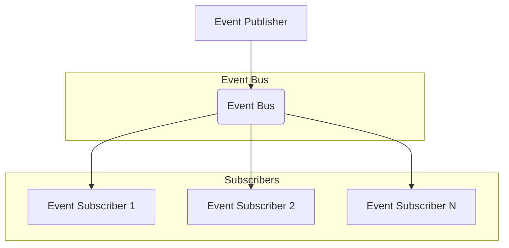

# DivineOS Communication Architecture

## IPC Architecture

The communication between the deterministic kernel and AI runtime is designed with strict security and performance boundaries. The architecture uses a hybrid approach combining:

1. **Synchronous RPC calls** for critical deterministic operations
2. **Asynchronous message queues** for non-critical AI operations
3. **Shared memory regions** for high-frequency data exchange
4. **Event bus** for system-wide notifications

### Communication Layers

```
┌─────────────────────────────────────────────────────────────────┐
│                    Application Layer                            │
├─────────────────────────────────────────────────────────────────┤
│              AI Control Plane (AI Runtime)                      │
│  ┌─────────────────────────────────────────────────────────┐   │
│  │           gRPC Service Interface                        │   │
│  │  ┌─────────────────────────────────────────────────┐   │   │
│  │  │        Kernel Service Interface                 │   │   │
│  │  │  ┌─────────────────────────────────────────┐   │   │   │
│  │  │  │         Kernel Core Services           │   │   │   │
│  │  │  └─────────────────────────────────────────┘   │   │   │
│  │  └─────────────────────────────────────────────────┘   │   │
│  └─────────────────────────────────────────────────────────┘   │
│                                                                 │
│  ┌─────────────────────────────────────────────────────────┐   │
│  │           gRPC Service Interface                        │   │
│  │  ┌─────────────────────────────────────────────────┐   │   │
│  │  │        AI Service Interface                   │   │   │
│  │  │  ┌─────────────────────────────────────────┐   │   │   │
│  │  │  │         AI Core Services               │   │   │   │
│  │  │  └─────────────────────────────────────────┘   │   │   │
│  │  └─────────────────────────────────────────────────┘   │   │
│  └─────────────────────────────────────────────────────────┘   │
└─────────────────────────────────────────────────────────────────┘
```

## Event Bus Design

The system uses a publish-subscribe event bus for asynchronous communication:

### Event Types

1. **Process Lifecycle Events**
   - Process created
   - Process started
   - Process terminated
   - Process suspended
   - Process resumed

2. **System Events**
   - Resource usage statistics
   - System health metrics
   - Security alerts
   - AI decisions
   - Optimization results

3. **Telemetry Events**
   - Performance metrics
   - Resource utilization
   - Security incidents

### Event Bus Architecture



## Kernel APIs Exposed to AI

### Resource Management APIs
- `get_resource_stats()` - Get current system resource usage
- `get_process_info(pid)` - Get detailed process information
- `get_system_health()` - Get system health metrics

### Scheduling APIs
- `request_scheduling_decision(context)` - Request AI scheduling recommendation
- `request_memory_allocation(request)` - Request memory allocation

### Security APIs
- `evaluate_security_policy(policy)` - Evaluate security policy for process operations

### Notification APIs
- `notify_ai_decision(decision)` - Notify kernel of AI decision

## AI APIs Exposed to Kernel Services

### Performance APIs
- `get_ai_performance()` - Get AI model performance metrics
- `get_model_status()` - Get current AI model status

### Optimization APIs
- `request_optimization(context)` - Request AI optimization recommendation
- `update_model(data)` - Update AI model with new data

### Security Intelligence APIs
- `request_security_decision(context)` - Request AI security decision

## Scheduler Interface

### Scheduling Context
The scheduler interface accepts a comprehensive context that includes:
- Process identification and priority
- Resource requirements
- Historical performance data
- Current system load
- Timestamp for temporal consistency

### Scheduling Decision
The scheduler returns a decision with:
- Recommended process priority
- Estimated execution time
- Resource allocation details
- Confidence level in the recommendation
- Timestamp for tracking

### Deterministic Approval Requirements
The following scheduling operations require deterministic approval:
1. Process priority changes that affect real-time guarantees
2. Resource allocation that impacts system stability
3. Process termination decisions
4. Process suspension/resumption for critical services

## Memory Management Interface

### Memory Request Structure
Memory requests include:
- Process identifier
- Requested size
- Allocation type (heap, stack, mmap, shared)
- Priority level
- Timeout duration

### Memory Allocation Response
Memory allocation responses include:
- Process identifier
- Memory address
- Allocated size
- Allocation type
- Timestamp

### Deterministic Approval Requirements
Memory allocation operations requiring approval:
1. Allocation of critical system memory
2. Allocation that would cause memory pressure
3. Shared memory allocation for inter-process communication
4. Memory mapping operations that affect system stability

## Security Capability Model

### Trust Levels
1. **Trusted** - Kernel and AI control plane components
2. **Semi-Trusted** - System services and drivers
3. **Untrusted** - User applications

### Security Operations
- Read operations on system resources
- Write operations on system resources
- Execute operations on code
- Network access
- File system access

### Security Decision Process
1. Security policy evaluation request
2. Context analysis (process, operation, resource)
3. Decision generation (allow/deny)
4. Reason logging for audit trails

## Process Lifecycle

### Process States
1. **Created** - Process initialized but not yet running
2. **Running** - Process actively executing
3. **Waiting** - Process waiting for resources or events
4. **Blocked** - Process blocked by system constraints
5. **Suspended** - Process temporarily suspended
6. **Terminated** - Process completed or terminated

### Lifecycle Events
- Process creation notification
- Process start notification
- Process termination notification
- Process suspension notification
- Process resumption notification

## System Event Taxonomy

### Event Categories
1. **Process Events** - Process lifecycle and state changes
2. **Resource Events** - Resource usage and allocation
3. **Security Events** - Security incidents and policy violations
4. **AI Events** - AI decisions and model updates
5. **System Events** - Overall system health and status

### Event Prioritization
- **Critical** - Immediate system response required
- **High** - Important for system stability
- **Medium** - Regular monitoring needed
- **Low** - Background processing

## Telemetry Pipeline

### Data Collection Points
1. **Kernel Level** - System resource usage, process states
2. **AI Level** - Model performance, optimization decisions
3. **Application Level** - User application behavior

### Data Processing
1. **Collection** - Gather telemetry data from all sources
2. **Validation** - Validate data integrity and format
3. **Aggregation** - Aggregate data for analysis
4. **Storage** - Store telemetry data for historical analysis
5. **Analysis** - Analyze patterns and trends

### Data Flow
```
┌─────────────┐    ┌─────────────┐    ┌─────────────┐    ┌─────────────┐
│  Kernel     │───▶│  AI Runtime │───▶│  Telemetry  │───▶│  Analytics  │
│  Services   │    │  Services   │    │  Storage    │    │  Engine     │
└─────────────┘    └─────────────┘    └─────────────┘    └─────────────┘
```

## Message Schemas

### Core Message Types
1. **ResourceStats** - System resource usage statistics
2. **ProcessInfo** - Process information and status
3. **SystemHealth** - System health metrics
4. **SchedulingContext** - Context for scheduling decisions
5. **SchedulingDecision** - AI scheduling recommendations
6. **MemoryRequest** - Memory allocation requests
7. **MemoryAllocation** - Memory allocation responses
8. **SecurityPolicy** - Security policy evaluation requests
9. **SecurityDecision** - Security policy decisions
10. **AIDecision** - AI decision notifications

### Serialization Format
All messages are serialized using Protocol Buffers (protobuf) for:
- Binary efficiency
- Cross-language compatibility
- Strong typing
- Schema evolution support

## Versioning Strategy

### Protocol Versioning
- **Major Version** - Breaking changes to interface contracts
- **Minor Version** - Backward-compatible additions
- **Patch Version** - Bug fixes and minor improvements

### Interface Evolution
1. **Backward Compatibility** - New versions must support old clients
2. **Forward Compatibility** - Old versions must work with new servers
3. **Graceful Degradation** - Missing features should be handled gracefully

### Version Management
- Version information included in all messages
- Version negotiation during connection establishment
- Automatic fallback to compatible versions

## Serialization Format

### Protocol Buffers (protobuf)
- Binary serialization for efficiency
- Strong typing for safety
- Schema evolution support
- Cross-platform compatibility

### JSON Fallback
- Human-readable format for debugging
- Schema validation
- Integration with external tools

## State Synchronization Protocol

### Synchronization Points
1. **Boot Time** - Initial state synchronization
2. **Process Creation** - Process state propagation
3. **Resource Changes** - Resource allocation updates
4. **Security Events** - Security policy updates
5. **AI Model Updates** - Model state synchronization

### Synchronization Mechanism
1. **State Diff** - Only send changed state information
2. **Consistency Checks** - Validate state integrity
3. **Conflict Resolution** - Handle concurrent updates
4. **Recovery Mechanism** - Restore state on failures

## Error Handling Strategy

### Error Categories
1. **Kernel Errors** - Resource exhaustion, invalid operations
2. **AI Errors** - Model issues, inference failures
3. **Communication Errors** - Network issues, serialization problems

### Error Propagation
1. **Immediate Response** - Critical errors return immediately
2. **Graceful Degradation** - Non-critical errors allow fallback behavior
3. **Logging** - All errors logged for debugging and analysis
4. **Recovery** - Automatic recovery where possible

## Timing Constraints

### Real-time Requirements
1. **Critical Path** - Must complete within 1ms for process scheduling
2. **Security Decisions** - Must complete within 10ms for security operations
3. **Resource Allocation** - Must complete within 50ms for memory management
4. **System Monitoring** - Must complete within 100ms for health checks

### Timeout Management
1. **Request Timeout** - Default 500ms for most operations
2. **Response Timeout** - Immediate response for critical operations
3. **Retry Logic** - Automatic retries for transient failures
4. **Deadlock Prevention** - Timeout-based deadlock detection

## Deterministic Approval Requirements

### Operations Requiring Approval
1. **Process Priority Changes** - Any change that affects real-time guarantees
2. **Memory Allocation** - Critical system memory allocation
3. **Security Policy Violations** - Denial of security operations
4. **Process Termination** - Critical process termination decisions
5. **Resource Re-allocation** - Changes that affect system stability
6. **Scheduling Decisions** - High-priority scheduling changes
7. **Security Policy Updates** - Changes to security policies
8. **Model Updates** - AI model deployment and updates

### Approval Process
1. **Request Validation** - Validate request parameters
2. **Context Analysis** - Analyze system state and requirements
3. **Decision Making** - Make deterministic decision based on rules
4. **Execution** - Execute approved operation
5. **Logging** - Log decision and execution for audit

This communication architecture ensures that the deterministic kernel maintains control over critical system functions while allowing the AI runtime to provide intelligent optimization and decision-making capabilities.