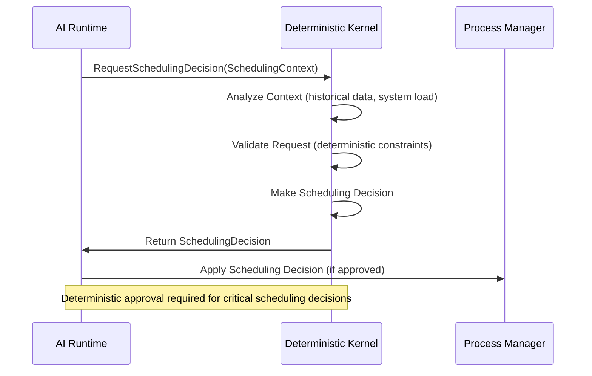
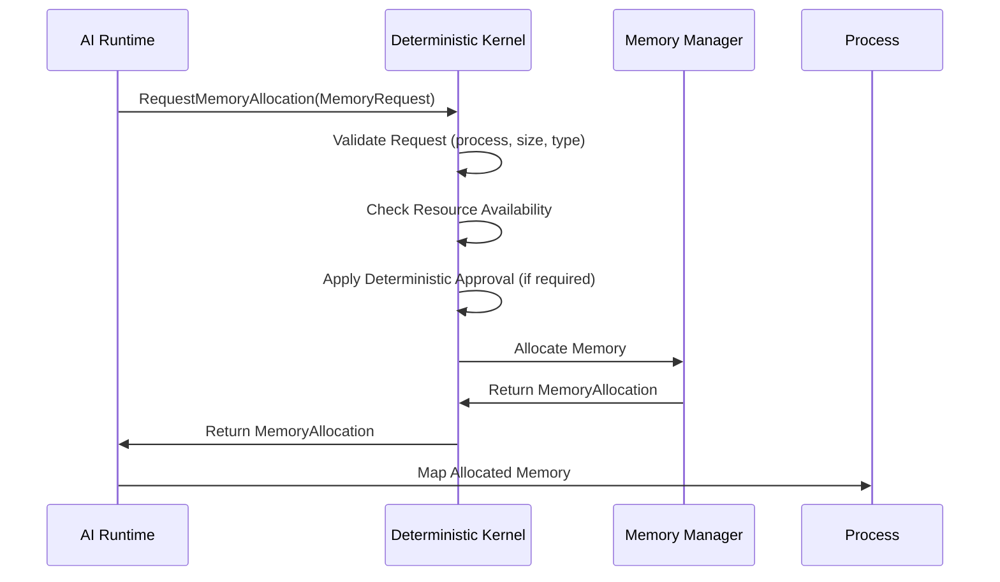
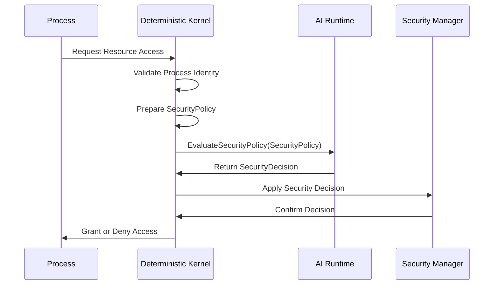
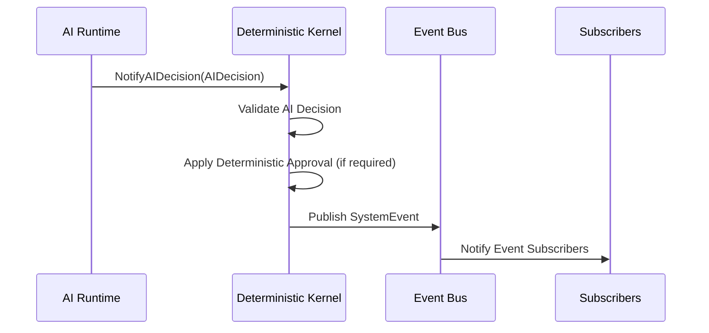
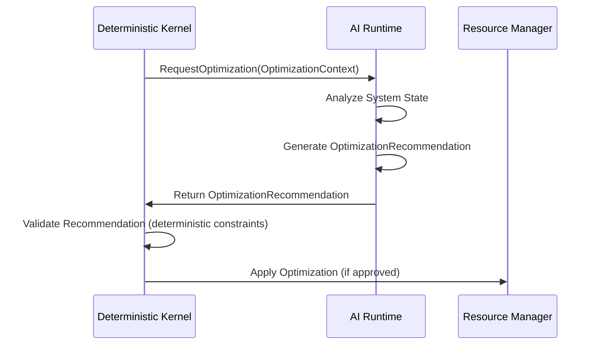
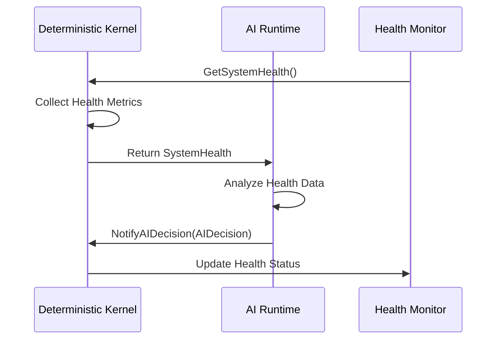
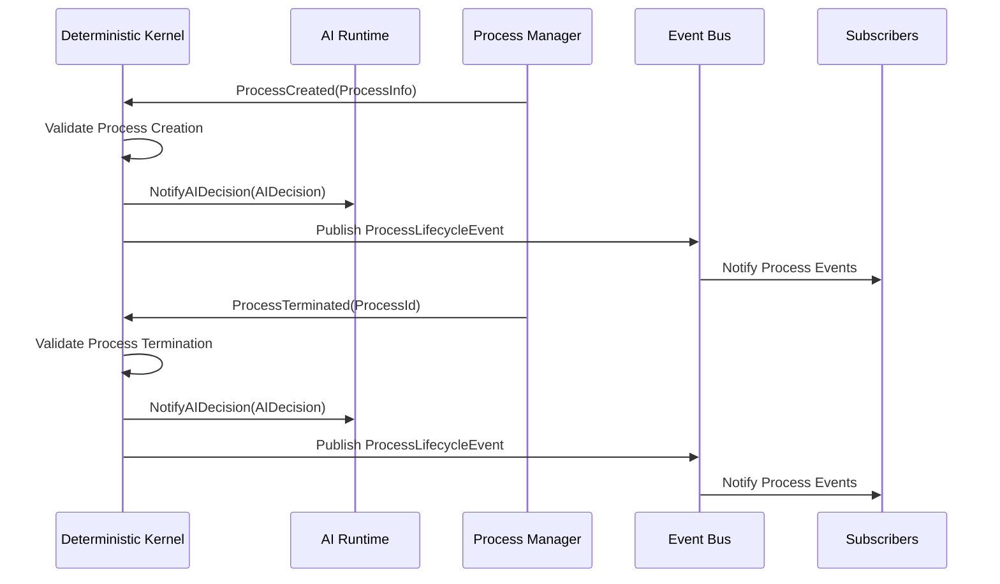
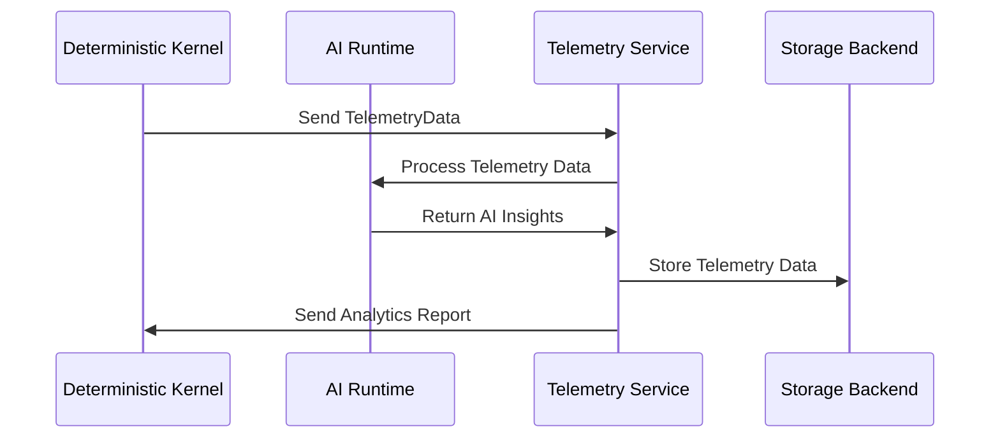
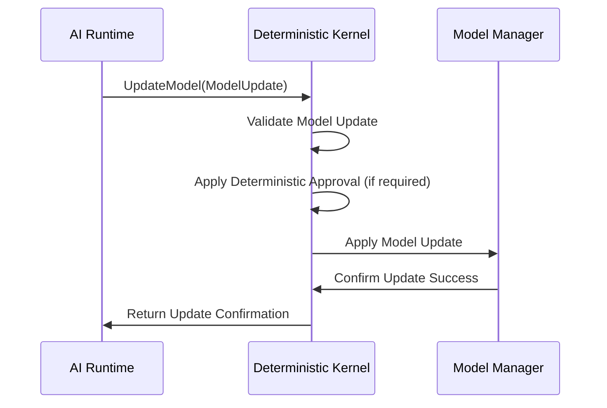
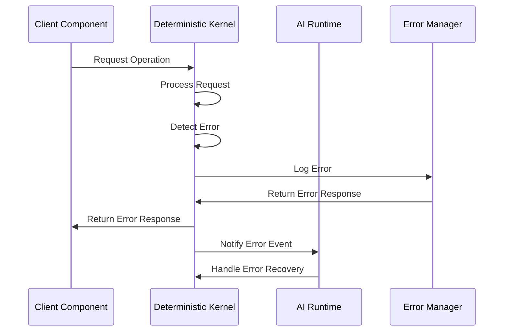

# DivineOS Communication Sequence Diagrams

## 1. Scheduling Decision Process

## 2. Memory Allocation Process

## 3. Security Policy Evaluation

## 4. AI Decision Notification

## 5. Optimization Recommendation Process

## 6. System Health Monitoring

## 7. Process Lifecycle Management

## 8. Telemetry Data Flow

## 9. Model Update Process

## 10. Error Handling Flow

These sequence diagrams illustrate the key communication flows between the deterministic kernel and AI runtime components, showing how deterministic approval is required for critical operations while allowing AI to provide intelligent optimization and decision-making capabilities.